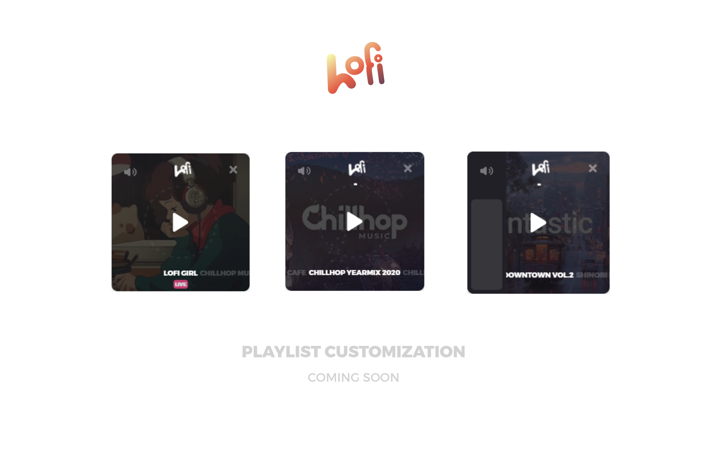

  

## Lofi Button
Lofi Button is a free player for lofi beats and radios on Youtube for your studying and coding needs!

- Built on the [Electron React Boilerplate](https://github.com/electron-react-boilerplate/electron-react-boilerplate)
- Using Youtube's Embed Player API through React-Player

### Installation

Head over to the *(Releases)[https://github.com/alderie/lofi-button/releases]* section to get the latest release of Lofi Button for your operating system

### Features

- Live Lofi Radios from Youtube
- Seeking support for regular videos
- Automatically change tracks after video ends (only for videos not for radios since they play indefinetely)

#### Planned Features

- [ ] Playlist Customization and Reordering
  - Currently not implemented because Youtube Embeds only allow for playing non-copyrighted music
- [ ] Non-intrusive keyboard controls 
  - Switching tracks with left/right arrow keys, volume control with up-down
- [ ] Speed up the startup time
  - Electron kinda slow
- [ ] More features? Suggest features with the Feature Request tag